<iframe frameborder="no" border="0" marginwidth="0" marginheight="0" width="100%" height=86 src="https://music.163.com/outchain/player?type=3&id=2531519221&auto=1&height=66"></iframe>

## [Hapi Go](https://www.hapigo.com/)

超级推荐的启动器，同时包含剪切板，翻译等常用工具，免费版也体验良好。

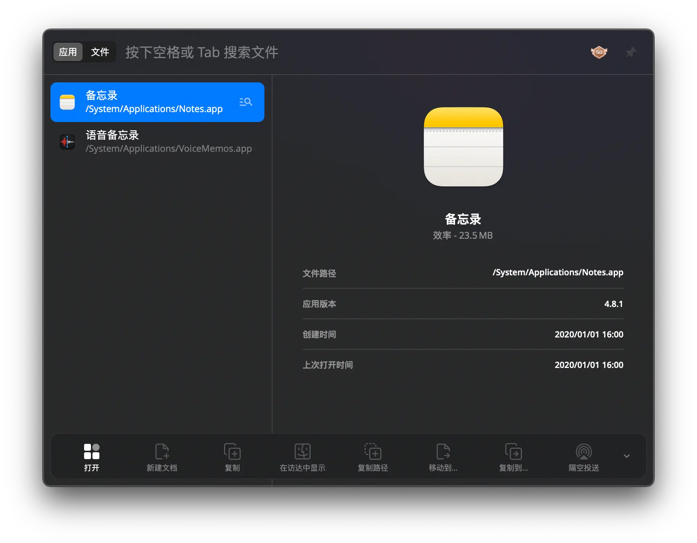  
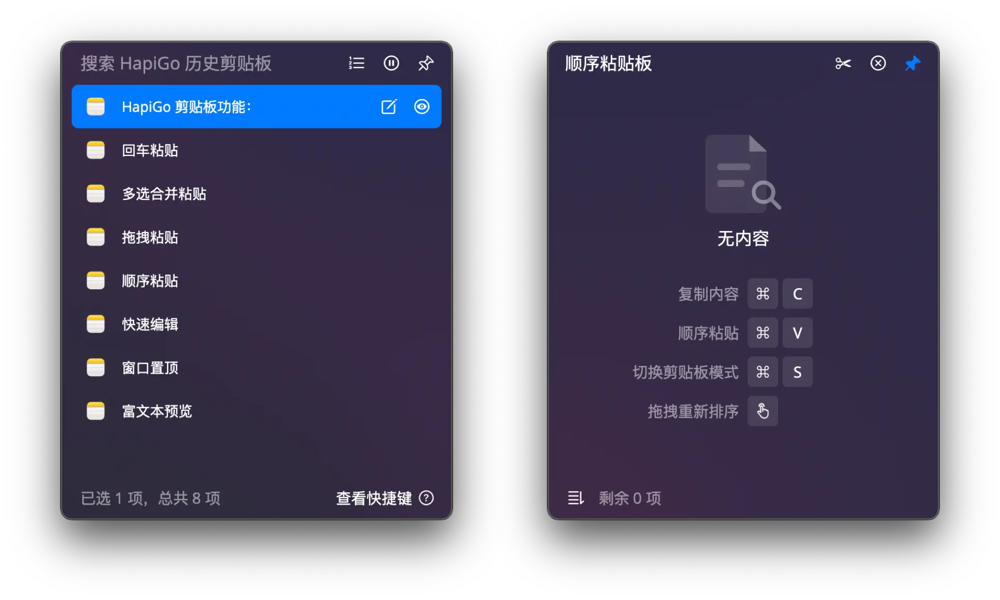  
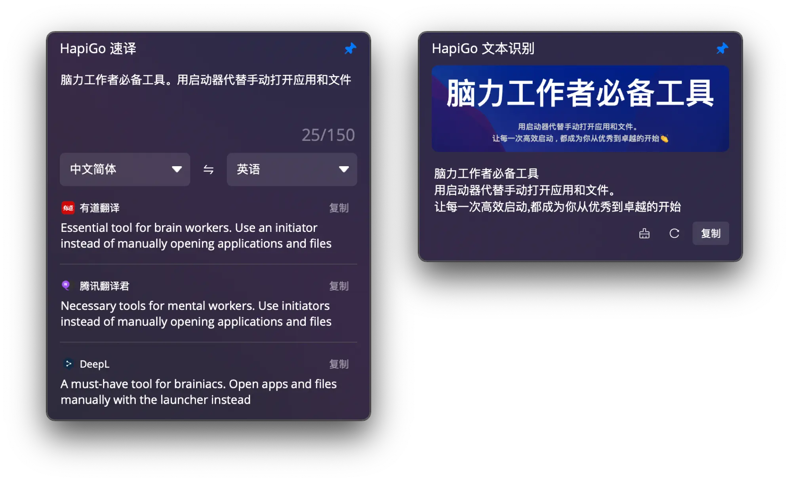  

## [Fig](https://fig.io/)

超级推荐的终端增强软件，可以在终端内命令提示，帮助管理常用脚本，SSH 连接，终端别名、环境变量。
插件生态丰富可以一键集成 Oh My Zsh，Spaceship Prompt 等等。

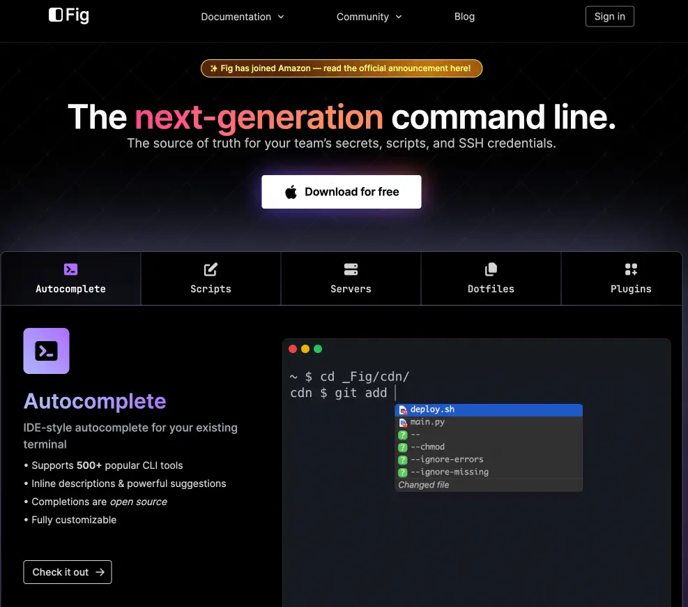

## [AltTab - Windows alt-tab on macOS](https://alt-tab-macos.netlify.app/)

Mac 自带的 `⌘ Tab` 窗口切换没有预览，并且对于同一软件的多个窗口没有区分，这个软件很好解决了这个问题，可以改快捷键替换系统窗口切换。

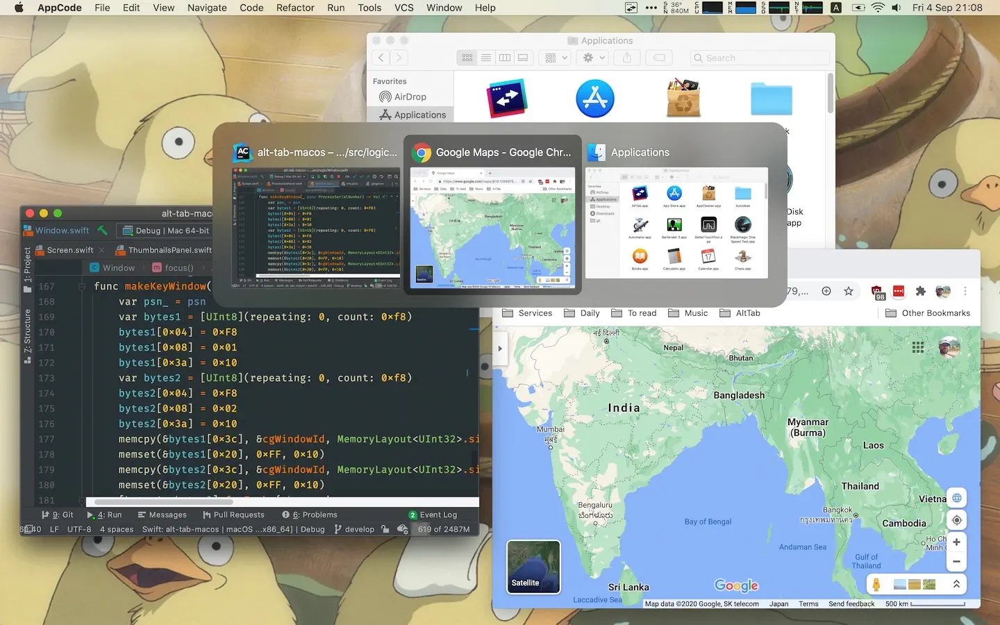

## [Notion](https://notion.so/)

All in one 的内容管理软件，模板丰富支持各种场景需求。

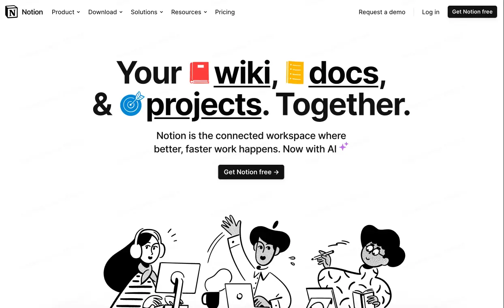

## [Arc](https://arc.net/)

打破传统浏览器交互模式的新生带浏览器，对我来说最关键的莫过于工作区 Profile，可以在同一个窗口切换不同工作区，如工作、个人，不同工作区配置完全隔离。

## [Shottr](https://shottr.cc/)

小巧的截图软件，支持截图编辑，长截屏。

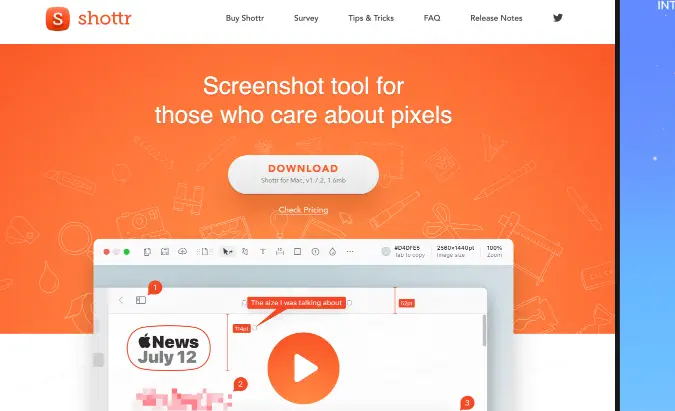

## [Kap](https://getkap.co/)

动图生成软件，对于需要录制操作的场景非常有帮助。

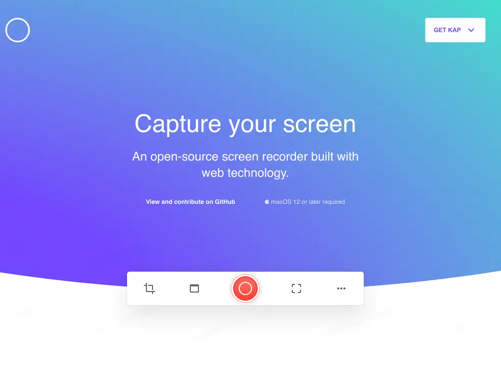

## [Better Display](https://github.com/waydabber/BetterDisplay)

你是否有遇到 2K 屏但是无法使用 1080P HiDpi（高分屏）功能，Mac 只支持 720P 太小，这个软件可以完美解决这个问题。同时提供丰富显示管理功能。

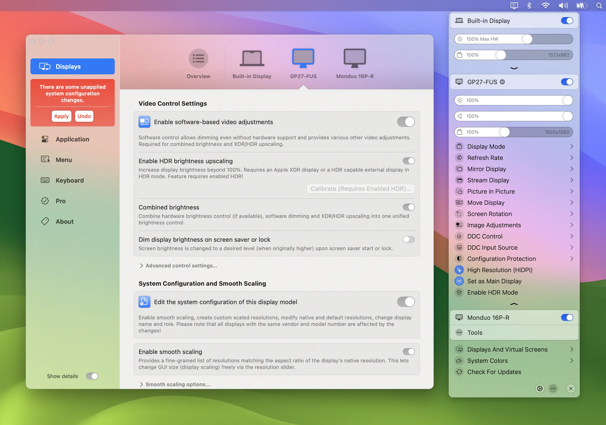

## [Neat Downloader](https://www.neatdownloadmanager.com/index.php/en/)

类似 Internet Download Manager 的免费分段并行下载工具，在下载速度缓慢的场景很有用。

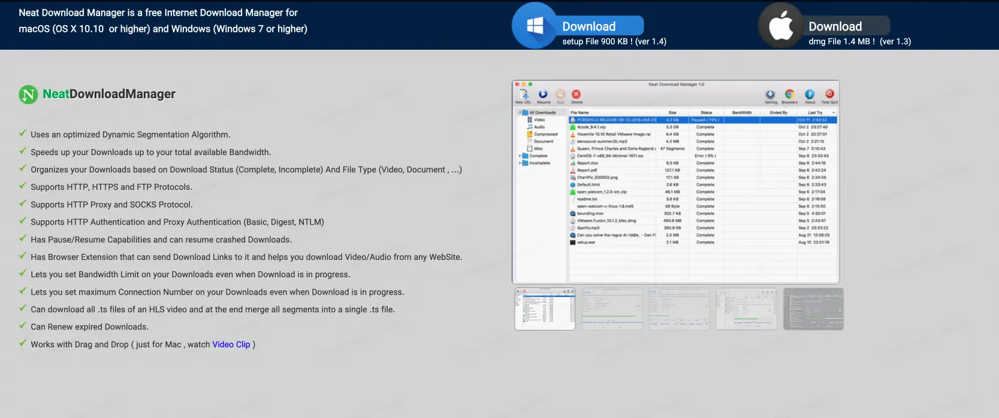

## [App Cleaner](http://freemacsoft.net/appcleaner/)

可以方便管理卸载软件，清理卸载残余。

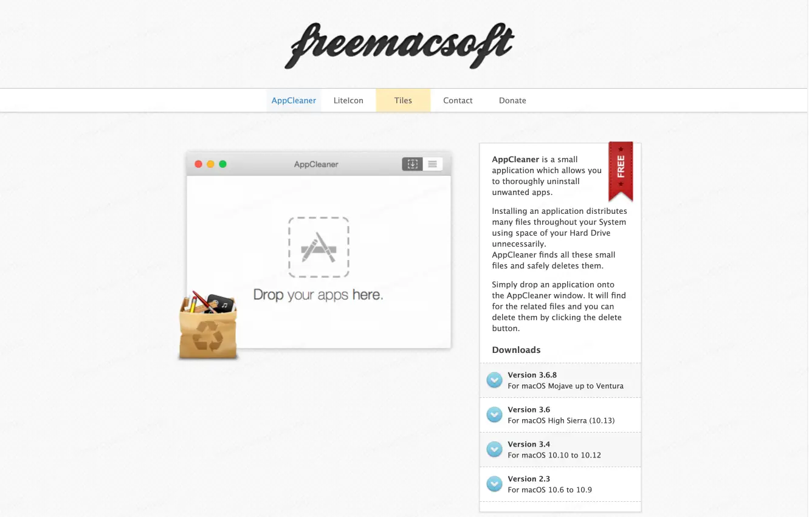

## [The Unarchiver](https://theunarchiver.com/)

免费支持多种格式的解压缩软件

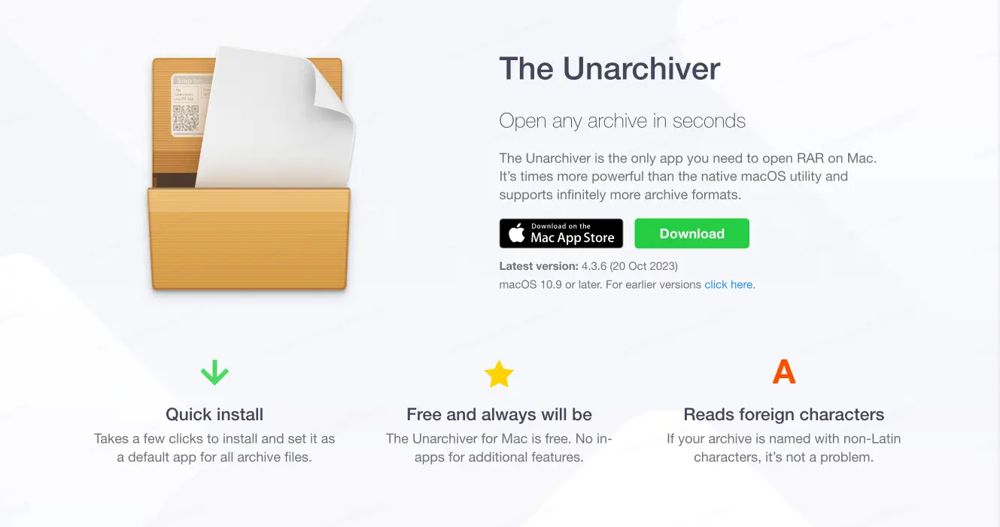

## [mkcert](https://github.com/FiloSottile/mkcert)

生成证书命令行工具，方便快速在本地搭建 Https 开发环境。

## [lux](https://github.com/iawia002/lux)

视频下载命令行工具，支持常见各大平台下载，丰富的下载设置。

